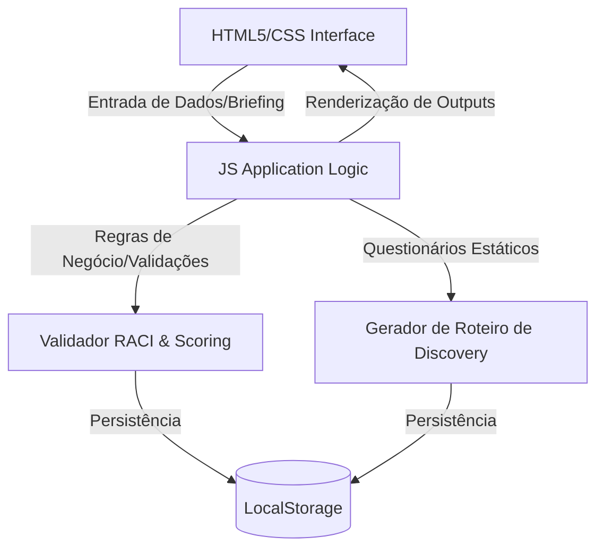

# Projeto Completo: AI Copilot de Pré-Vendas Clear IT (Onion Portable)

> **Propósito:** Este documento serve como bridge de comunicação entre a versão IDE do Onion Orquestrador e a versão ChatGPT. Contém todo o contexto necessário para entender, trabalhar e evoluir o projeto.

---

## 1. Visão Geral do Projeto

### 1.1. O que é o AI Copilot de Pré-Vendas
O **AI Copilot de Pré-Vendas (Squad C.4 Zimbra)** é um assistente inteligente projetado para o time de pré-vendas e engenharia de soluções da Clear IT. Ele centraliza as regras de negócio, o portfólio de soluções (Multicloud, Cibersegurança, SOC, COps) e parceiros homologados (Nutanix, Fortinet, Veeam, Lenovo, Dynatrace), automatizando a qualificação de oportunidades (Lead Scoring) e a geração de roteiros de descoberta técnica (*discovery*).

**Objetivo:** Transformar a TI corporativa em um motor estratégico a partir do primeiro contato comercial, otimizando o fluxo que vai da captação até a proposta final.

### 1.2. Stack Tecnológica
- **Frontend:** HTML5 semântico, Vanilla CSS (Design Responsivo, Variáveis CSS, Glassmorphism leve, Micro-animações)
- **Engine Lógica:** JavaScript moderno (ES6+), manipulação dinâmica de DOM
- **Persistência / Dados:** LocalStorage (`clearit_leads_v1`) para leads qualificados e carregamento de JSON estático embutido (Portfólio e KBs)
- **IA/LLM Engine:** Integração simulada / mockada ou API direta com LLM para orquestrar processamento de input e geração de roteiros
- **Fontes:** Inter e JetBrains Mono (identidade visual Clear IT)

### 1.3. Arquitetura
SPA monolítica em `index.html` (CSS + JS inline) — adequado ao escopo MVP.



---

## 2. Contexto de Negócio

### 2.1. Dores do Cliente (Problemas que resolvemos)
- **Falta de padronização comercial:** Falta de uniformidade nos critérios para identificar oportunidades relevantes baseadas no Perfil de Cliente Ideal (ICP)
- **Consolidação de dados ineficiente:** Dificuldade em coletar e consolidar as dores reais e a infraestrutura técnica do cliente
- **Alto tempo de preparação:** Média de **60 minutos** gastos por analista para preparar cada reunião estratégica de alinhamento
- **Inconsistência nos briefings:** Cerca de **40% dos briefings** comerciais chegam ao time de engenharia com informações incompletas ou inconsistentes
- **Retrabalho técnico:** Em média, **30% das oportunidades** exigem reuniões adicionais de discovery por falhas de coleta no primeiro contato
- **Perda de conhecimento histórico:** As lições aprendidas e propostas técnicas anteriores ficam restritas aos consultores individuais

### 2.2. Features Implementadas (Status: ✅ Feito)

| ID | Título | Descrição |
|---|---|---|
| F-01 | Qualificação e Lead Scoring Baseado em ICP | Avalia lucratividade, potencial de expansão e adequação ao ICP de Governo/Privado |
| F-02 | Geração Assistida de Roteiro de Discovery | Cria roteiros dinâmicos com perguntas por domínio (Redes, Cloud, SOC, COps) |
| F-03 | Recomendação de Escopo de Propostas | Sugere templates de escopo técnico, SLAs (SOC 24/7, COps) e exclusões comuns |
| F-04 | Auditoria de Modificações e Versionamento | Rastreamento histórico de edições nos dados dos leads e clientes |
| F-05 | Conversa Livre com Agente IA | Interface de chat natural com agente ancorado nas KBs e regras de negócio |

### 2.3. Validação do MVP (Baseline de Casos)
As features F-01 (Lead Scoring) e F-02 (Discovery) foram validadas com base em **30 casos reais de clientes** consolidados no histórico comercial da Clear IT.

**Fonte:** KB-12: Baseline de Casos e Validação MVP

**Cenários validados incluem:**
- Setores: Logística, Saúde, Educação, Governo, Varejo, Indústria, Financeiro, Tecnologia, Energia, Construção, Hotelaria, Mineração, Alimentos, Seguros, Transporte, Agronegócio, Distribuição
- Tecnologias: VMware, Fortinet, Veeam, Dell, Cisco, Microsoft, Nutanix, AWS, Azure, HPE, NetApp, SolarWinds, PRTG, Zabbix, Symantec
- Dores típicas: Storage sem suporte, backup inadequado, monitoramento reativo, VPN lenta, endpoints vulneráveis, switches obsoletos, compliance regulatório

---

## 3. Metodologia Onion (Personas e Ciclos)

### 3.1. Personas Ativas
Assuma conforme a intenção do usuário:
- **@product (Produto):** Foca em "O que e por quê" (requisitos, dores e critérios de aceite)
- **@engineer (Engenharia):** Foca em "Como" (arquitetura, qualidade e plano de implementação)
- **@meta (Knowledge Base - KB):** Pesquisa temas técnicos e gera KBs
- **@docs (Sincronismo e Sessões - Sync):** Faz engenharia reversa de código, sincroniza artefatos e registra o progresso/histórico de sessões
- **@onion (Orquestrador):** Persona padrão. Roteia fluxos, sugere passos, faz diagnósticos e gerencia o andamento do projeto

### 3.2. Ciclos de Desenvolvimento

#### Product Cycle (@product)
**Objetivo:** Transformar uma ideia em uma Feature especificada pronta para desenvolvimento

1. **Coleta (Collect):** Valide qual "Dor do Cliente" a ideia resolve
2. **Especificação (Spec):** Formule História do Usuário, Critérios de Aceite e Regras de Negócio
3. **Consolidação (Feature):** Preencha a seção "Especificações Ativas" do arquivo `business-context-lite.md`

#### Engineer Cycle (@engineer)
**Objetivo:** Transformar uma Feature especificada em código funcional de alta qualidade

1. **Início (Start):** Leia `business-context-lite.md` e `technical-context-lite.md`
2. **Planejamento (Plan):** Escreva uma seção "Plano para [Nome da Feature]" no `technical-context-lite.md`
3. **Execução (Work):** Gere o código seguindo o checklist
4. **Conclusão (Finish):** Forneça instruções de teste e atualize o status da Feature

#### Knowledge Base Cycle (@meta)
**Objetivo:** Estruturar e documentar novos conceitos e pesquisas técnicas

1. **Pesquisa e Extração:** Identifique conceitos centrais, limitações e melhores práticas
2. **Estruturação:** Siga o padrão (Visão Geral, Conceitos Chave, Exemplos Práticos, Armadilhas)
3. **Consolidação (KB Gerada):** Salve o arquivo em `docs/knowledge-base/[nome-do-tema].md`

#### Sync & Reverse Engineering Cycle (@docs)
**Objetivo:** Fazer engenharia reversa do código existente e sincronizar a documentação

1. **Ingestão de Código:** Varra o projeto e identifique stack, fluxo arquitetural e regras de negócio
2. **Sincronização Técnica:** Atualize `technical-context-lite.md`
3. **Sincronização de Negócio:** Atualize `business-context-lite.md`
4. **Validação:** Confirme se os documentos refletem adequadamente o estado do projeto

#### Session & Progress Cycle (@docs)
**Objetivo:** Registrar as decisões, alterações e estado de cada sessão de desenvolvimento

1. **Início e Gatilho:** Ativado ao término de cada sessão ou comando `/session "nome-do-topico"`
2. **Coleta de Métricas:** Identifique arquivos modificados, decisões e progresso
3. **Geração do Registro:** Crie pasta em `docs/sessions/YYYY-MM-DD_HHMM_nome-do-topico/` com arquivos de sessão
4. **Atualização do Índice:** Atualize `docs/sessions/README.md`

---

## 4. Estrutura de Arquivos

```
onion-portable/
├── index.html                          # SPA principal (Dashboard, Qualificação, Discovery, KB Viewer, Chat, Auditoria)
├── docs/
│   ├── business-context-lite.md        # Fonte de verdade para Produto (features, dores, especificações)
│   ├── technical-context-lite.md       # Fonte de verdade para Engenharia (stack, arquitetura, planos)
│   ├── onion-cycles.md                # Ciclos de desenvolvimento do Onion (personas e workflows)
│   ├── chatgpt-bridge/                # Bridge de comunicação com ChatGPT
│   │   ├── envio/                     # Arquivos para enviar ao ChatGPT
│   │   └── recebimento/               # Respostas do ChatGPT
│   ├── knowledge-base/                # Base de conhecimento consolidada
│   │   ├── core/                      # Conceitos fundamentais (KB-01, KB-02, KB-03, KB-10, KB-12)
│   │   ├── technical/                 # Documentação técnica (KB-04, KB-05, KB-06, KB-07)
│   │   ├── design/                    # Identidade visual e UI (KB-08, KB-09, KB-11)
│   │   ├── prompts/                   # Prompts e system prompts (KB-06)
│   │   └── legacy/                    # Documentos legados (histórico)
│   └── sessions/                      # Registros de sessões de desenvolvimento
└── AGENTS.md                          # Regras do Onion Orquestrador (master prompt)
```

---

## 5. Knowledge Base (KBs)

### 5.1. KBs Core (Conceitos Fundamentais)
- **KB-01:** Portfólio de Soluções e Ecossistema de Parceiros
- **KB-02:** Processo de Pré-Vendas e Matriz RACI
- **KB-03:** Ideal Customer Profile (ICP) e Personas da Clear IT
- **KB-10:** Classificações de Oportunidades e Critérios de Qualificação
- **KB-12:** Baseline de Casos e Validação MVP (30 casos reais de clientes)

### 5.2. KBs Technical (Documentação Técnica)
- **KB-04:** Questionários de Discovery Técnico
- **KB-05:** Ancoragem de Portfólio e Engenharia de Prompt para Classificadores
- **KB-06:** Validação e Formatação de Campos
- **KB-07:** IA Auxílio Sites

### 5.3. KBs Design (Identidade Visual e UI)
- **KB-08:** Identidade da IA — Clear AI
- **KB-09:** Boas Práticas de Esquema de Cores e Organização para Sites
- **KB-11:** Estruturação de Sites e Hierarquia Visual

### 5.4. KBs Prompts (Prompts e System Prompts)
- **KB-06:** System Prompt — Agente de Storytelling Técnico de Pré-Vendas

---

## 6. Padrões de Código

- **Estrutura de Arquivos:** SPA monolítica em `index.html` (CSS + JS inline)
- **Nomenclatura:** Padrão *kebab-case* para classes CSS e arquivos; *camelCase* para variáveis e funções JS
- **Segurança:** Sanitização via `escapeHtml()` antes de renderizar dados de usuário em `innerHTML`
- **Interface Visual:** Paleta dark Clear IT (orange `#ff6b00`), glassmorphism sutil em cards (`backdrop-filter`)

---

## 7. Como Trabalhar com Este Projeto

### 7.1. Para Adicionar uma Nova Feature
1. Ative **@product** → detalhar negócio em `business-context-lite.md` via Product Cycle
2. Ative **@engineer** → detalhar plano em `technical-context-lite.md` via Engineer Cycle
3. SÓ ENTÃO codificar

### 7.2. Para Pesquisar um Tema Técnico
1. Ative **@meta** → pesquisar tema e gerar KB
2. Salvar em `docs/knowledge-base/[categoria]/kb-XX-[tema].md`

### 7.3. Para Sincronizar Documentação
1. Ative **@docs** → fazer engenharia reversa do código
2. Atualizar `technical-context-lite.md` e `business-context-lite.md`
3. Registrar sessão em `docs/sessions/`

### 7.4. Para Comunicar com ChatGPT
1. Coloque este arquivo em `docs/chatgpt-bridge/envio/projeto-completo.md`
2. Envie ao ChatGPT com instruções específicas
3. Receba resposta em `docs/chatgpt-bridge/recebimento/`
4. Integre as respostas de volta ao projeto

---

## 8. Estado Atual do Projeto

### 8.1. Features Implementadas
- ✅ F-01: Qualificação e Lead Scoring Baseado em ICP
- ✅ F-02: Geração Assistida de Roteiro de Discovery
- ✅ F-03: Recomendação de Escopo de Propostas
- ✅ F-04: Auditoria de Modificações e Versionamento
- ✅ F-05: Conversa Livre com Agente IA

### 8.2. Arquivos Principais
- `index.html` - SPA principal com todas as views implementadas
- `docs/business-context-lite.md` - Contexto de negócio atualizado
- `docs/technical-context-lite.md` - Contexto técnico atualizado
- `docs/knowledge-base/` - KBs estruturadas e organizadas

### 8.3. Próximos Passos
- Avaliar necessidade de novas features
- Refinar implementações existentes
- Expandir Knowledge Base com novos temas
- Melhorar integração com LLM real

---

## 9. Referências Rápidas

### 9.1. Arquivos de Contexto
- **Negócio:** `docs/business-context-lite.md`
- **Técnico:** `docs/technical-context-lite.md`
- **Ciclos:** `docs/onion-cycles.md`
- **Regras Onion:** `AGENTS.md`

### 9.2. Scripts de Automação
- **Atualização KB README:** `docs/knowledge-base/update-readme.ps1`

### 9.3. Identidade Visual
- **Paleta de Cores:** `docs/knowledge-base/design/guia_de_palheta_de_cores.md`
- **Boas Práticas:** `docs/knowledge-base/design/kb-09-boas-praticas-cores-modo-claro-escuro.md`

---

**Versão deste documento:** 1.0  
**Data:** 08/07/2026  
**Status:** Produção  
**Propósito:** Bridge de comunicação Onion IDE ↔ ChatGPT
