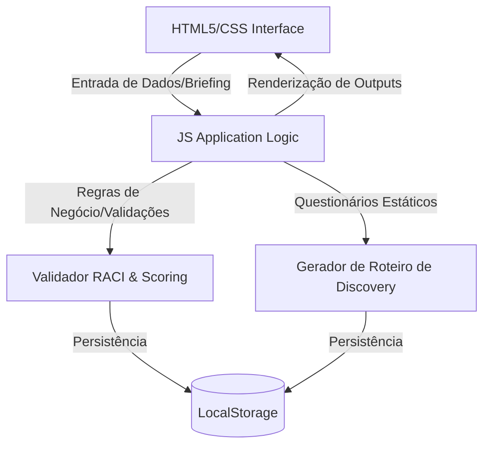

# Technical Context — AI Copilot de Pré-Vendas Clear IT

> Este arquivo é a fonte de verdade para Engenharia. O agente `@engineer` atualizará este arquivo quando houver mudanças na arquitetura.

## 1. Stack Tecnológica
* **Frontend:** HTML5 semântico, Vanilla CSS (Design Responsivo, Variáveis CSS, Glassmorphism leve, Micro-animações).
* **Engine Lógica:** JavaScript moderno (ES6+), manipulação dinâmica de DOM.
* **Persistência / Dados:** LocalStorage (`clearit_leads_v1`) para leads qualificados e carregamento de JSON estático embutido (Portfólio e KBs).
* **IA/LLM Engine:** Integração simulada / mockada ou API direta com LLM para orquestrar:
  1. Processamento de input do Lead para cálculo de Scoring.
  2. Geração automatizada de Roteiros de Discovery com base nos domínios do questionário.

> **Nota de implementação:** Fontes adotadas no app são **Inter** e **JetBrains Mono** (identidade visual Clear IT), em substituição à referência original Outfit/Space Grotesk.

## 2. Padrões de Código (Code Standards)
* **Estrutura de Arquivos:** SPA monolítica em `index.html` (CSS + JS inline) — adequado ao escopo MVP.
* **Nomenclatura:** Padrão *kebab-case* para classes CSS e arquivos; *camelCase* para variáveis e funções JS.
* **Segurança:** Sanitização via `escapeHtml()` antes de renderizar dados de usuário em `innerHTML`.
* **Interface Visual:** Paleta dark Clear IT (orange `#ff6b00`), glassmorphism sutil em cards (`backdrop-filter`).

## 3. Arquitetura Lógica (Visão Simplificada)

## 4. Planos de Implementação

### Plano concluído: AI Copilot Frontend (F-01 e F-02)

#### Arquivos:
- `[DONE] index.html` — SPA principal (Dashboard, Qualificação, Discovery, KB Viewer).
- `[DONE] docs/business-context-lite.md` — Status F-01/F-02 marcados como Feito.

#### Checklist de Execução:
- [x] Criar estrutura base do HTML5 e importar fontes Google Fonts.
- [x] Implementar design system em CSS (variáveis, dark mode, glassmorphism e animações).
- [x] Construir layout da SPA com barra lateral de navegação e área de conteúdo dinâmico.
- [x] Implementar o motor de Qualificação e Scoring de Leads (F-01) com validações RACI.
- [x] Implementar o Assistente de Discovery Técnico (F-02) com roteiros dinâmicos e alertas por keywords.
- [x] Adicionar visualizador e buscador interativo do Portfólio e KBs (KB-01 a KB-06).
- [x] Portfolio Boundary Test (T-01 a T-05) — guardrails de escopo no discovery.
- [x] Persistência de leads via LocalStorage.
- [x] Sanitização XSS em renderização de dados de usuário.
- [x] Media queries para responsividade (tablet/mobile).

---

### Plano concluído: Recomendação de Escopo (F-03)

> Spec de negócio preenchida em `business-context-lite.md`. Implementação concluída.

#### Arquivos modificados:
- `[DONE] index.html` — Nova view "Proposta" com gerador de escopo baseado em domínios selecionados.
- `[DONE] docs/business-context-lite.md` — Status atualizado para Feito.

#### Checklist de implementação:
- [x] Analisar KB-01 (Portfólio), KB-02 (Processo) e KB-05 (Ancoragem) para extrair SLAs e exclusões
- [x] Criar view "Proposta" com seleção de domínios (checkboxes para SOC, COps, Infra, Cyber)
- [x] Implementar gerador de escopo dinâmico baseado em domínios selecionados
- [x] Mapear SLAs contratuais padrão:
  - SOC 24/7: N1 (Triagem), N2 (Análise), N3 (Resposta Avançada)
  - COps: N0 (Automação), N1-N3 (Monitoramento)
- [x] Incluir seção de exclusões padrão (KB-01 e KB-05):
  - Service Desk / Field Service
  - Cabeamento estruturado
  - Desenvolvimento customizado
  - Hardware legado não homologado
- [x] Implementar validação de conformidade (guardrails de KB-05):
  - Alertar se domínio selecionado não está no portfólio
  - Sinalizar lacunas explicitamente
- [x] Adicionar botão "Copiar Escopo" para exportar texto formatado
- [x] Integrar com dados do lead qualificado (recuperar do LocalStorage)
- [x] Testar fluxo completo: qualificação → discovery → proposta

---

### Backlog futuro: Auditoria e Versionamento (F-04)
- Sem plano técnico ainda. Requer spec `@product` antes de engenharia.

---

### Plano futuro: Workspace Inteligente do Consultor (F-06)

> Spec de negócio preenchida em `business-context-lite.md`. Status: Pronto para Dev.

#### Arquivos a serem modificados:
- `[TODO] index.html` — Redesenhar interface para workspace conversacional centralizado
- `[TODO] docs/technical-context-lite.md` — Este plano técnico

#### Checklist de implementação:
- [ ] Redesenhar layout da SPA para remover 70-80% dos elementos visuais atuais
- [ ] Manter apenas: chat central, campo de texto, sugestões rápidas, botão de voz, botão de anexos, histórico
- [ ] Implementar suporte multimodal para entrada:
  - Texto (já existe)
  - Áudio (ditado via Web Speech API)
  - PDF (extração de texto via PDF.js)
  - DOCX (extração de texto via mammoth.js)
  - Imagem (OCR via Tesseract.js)
  - E-mail (parser de conteúdo)
  - RFP/Edital (parser de conteúdo)
- [ ] Implementar orquestrador de agentes:
  - Intention Detection Engine (identificar Lead, Discovery, Proposal, Knowledge, Audit)
  - Agent Router (acionar agente correto automaticamente)
  - Response Consolidator (integrar outputs de múltiplos agentes)
- [ ] Manter agentes existentes como módulos internos (não visíveis na UI):
  - Lead Agent (F-01)
  - Discovery Agent (F-02)
  - Proposal Agent (F-03)
  - Audit Agent (F-04)
  - Knowledge Agent (F-05)
- [ ] Alterar pergunta inicial de "Qual funcionalidade deseja utilizar?" para "O que você recebeu do cliente hoje?"
- [ ] Implementar mascaramento de dados sensíveis em todas as entradas (já existe para chat)
- [ ] Testar fluxo completo: envio multimodal → detecção de intenção → orquestração → resposta consolidada
- [ ] Garantir compatibilidade com arquitetura existente (LocalStorage, KBs, regras de negócio)

#### Dependências externas:
- PDF.js (extração de texto de PDFs)
- mammoth.js (extração de texto de DOCX)
- Tesseract.js (OCR de imagens)
- Web Speech API (ditado por voz - nativo do navegador)

#### Considerações de arquitetura:
- Preservar toda a lógica existente de F-01 a F-05
- Agentes continuam existindo como funções/módulos internos
- Apenas a interface muda (de módulos separados para chat centralizado)
- Orquestrador atua como dispatcher baseado em intenção detectada

---

### Plano concluído: Conversa Livre com Agente IA (F-05)

> Spec de negócio preenchida em `business-context-lite.md`. Implementação concluída.

#### Arquivos modificados:
- `[DONE] index.html` — Nova view "Chat" com interface de conversação e motor de respostas baseado em KBs.
- `[DONE] docs/business-context-lite.md` — Status atualizado para Feito.

#### Checklist de implementação:
- [x] Criar view "Chat" com interface de chat (input de texto, histórico de mensagens)
- [x] Implementar motor de respostas baseado em KBs (KB-01 a KB-06):
  - Indexação de conteúdo das KBs para busca semântica
  - Sistema de matching de keywords para respostas rápidas
- [x] Implementar guardrails de escopo (KB-05):
  - Detectar perguntas sobre serviços fora do portfólio
  - Responder com frase canônica de lacuna
- [x] Implementar persona Onion Orquestrador:
  - Roteamento para @product, @engineer, @meta, @docs conforme intenção
  - Manutenção de contexto de conversa
- [x] Integrar com LocalStorage:
  - Acessar leads qualificados para contextualizar respostas
  - Referenciar dados de oportunidades quando pertinente
- [x] Adicionar sugestões de perguntas rápidas (quick prompts)
- [x] Implementar sanitização XSS em mensagens do usuário
- [ ] Implementar mascaramento de dados sensíveis antes de chamadas LLM:
  - Regex para CNPJ: `\d{2}\.\d{3}\.\d{3}/\d{4}-\d{2}` → `[CNPJ_MASCARADO]`
  - Regex para CPF: `\d{3}\.\d{3}\.\d{3}-\d{2}` → `[CPF_MASCARADO]`
  - Regex para email: `[a-zA-Z0-9._%+-]+@[a-zA-Z0-9.-]+\.[a-zA-Z]{2,}` → `[EMAIL_MASCARADO]`
  - Regex para telefone: `\(\d{2}\)\s*\d{4,5}-\d{4}` → `[TELEFONE_MASCARADO]`
  - Regex para SEI: `\d{6}-\d{7}` → `[SEI_MASCARADO]`
  - Função `maskSensitiveData(text)` aplicada antes de `generateAgentResponse()`
- [x] Testar fluxo completo: perguntas sobre portfólio, processos, lacunas

---

### Plano concluído: Auditoria de Modificações e Versionamento (F-04)

> Spec de negócio preenchida em `business-context-lite.md`. Implementação concluída.

#### Arquivos modificados:
- `[DONE] index.html` — Nova view "Auditoria" com histórico de modificações e log de ações.
- `[DONE] docs/business-context-lite.md` — Status atualizado para Feito.

#### Checklist de implementação:
- [x] Criar view "Auditoria" com tabela de histórico de modificações por lead
- [x] Implementar sistema de tracking de mudanças:
  - Registro de timestamp, usuário e campos alterados
  - Detecção automática de diferenças entre versões
- [x] Implementar log de auditoria:
  - Registro de ações críticas (qualificação, geração de proposta)
  - Filtro por lead, período e tipo de ação
- [x] Implementar exportação de log em CSV:
  - Formato compatível com compliance
  - Incluir todos os campos de auditoria
- [x] Testar fluxo completo: modificação → registro → visualização → exportação
